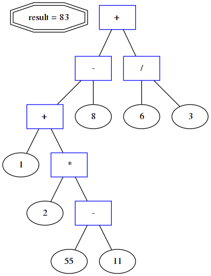

# AST OF MATH EXPRESSION
It's a part of task for ISP RAS course.

UptDate:\
To see the developing of this code go to [link](https://github.com/vvdvortsova/recursive_descent_parser).\
To build ast tree I use marshalling yard algorithm.

Sorry for mix c/c++, because
I just started writing in c++.\
The code will improve.
## Description
1 + 2 * ( 55 - 11 ) - 8 + 6 / 3

## Installing
```bash
git clone https://github.com/vvdvortsova/parse_tree_of_mathematical_expressions.git
```
For latex
```bash
sudo apt-get install texlive-latex-base
```
For graviz for Ubuntu
```bash
sudo apt install graphviz
```
## Structure
- Source project 
    - src/
- Test project
    - test/
## Run

How to run
```bash
cmake .
make
./treeExpr [flag] [outfile] [expr]
```
flags
```bash
-a Creates graviz dump and call dot
   and creates tex dump and call pdflatex
-g Creates graviz dump and call dot
-t Creates tex dump and call pdflatex
-v Creates tex dump and graviz
   do not call dot and pdflatex
Without params is like -a
```
For latex
```bash
pdflatex -pdf tex1.tex
```
For graviz
```bash
 dot -Tpdf gr1.dot -o gr1.pdf
```
Warning, please
 * It is important to use space when you write brackets.
 * Example: ( 1 + 2 ) not (1+2) or (1 + 2)
 * Do'not worry I'l fixed it as soon as possible.\
Example:
```bash
./treeExpr -a test1 "1 + 2 * ( 12 - -8 ) * 2"
```

OutFiles
```bash
test1_grav.dot
test1_grav.pdf
test1_tex.aux
test1_tex.log
test1_tex.pdf
test1_tex.tex
```


## Documentation
You can watch documentation by opening
```docs/html/index.html ``` in browser.

## OS
 KUbuntu 18.04
